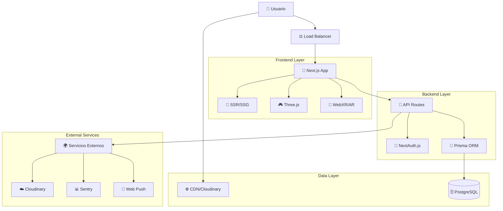
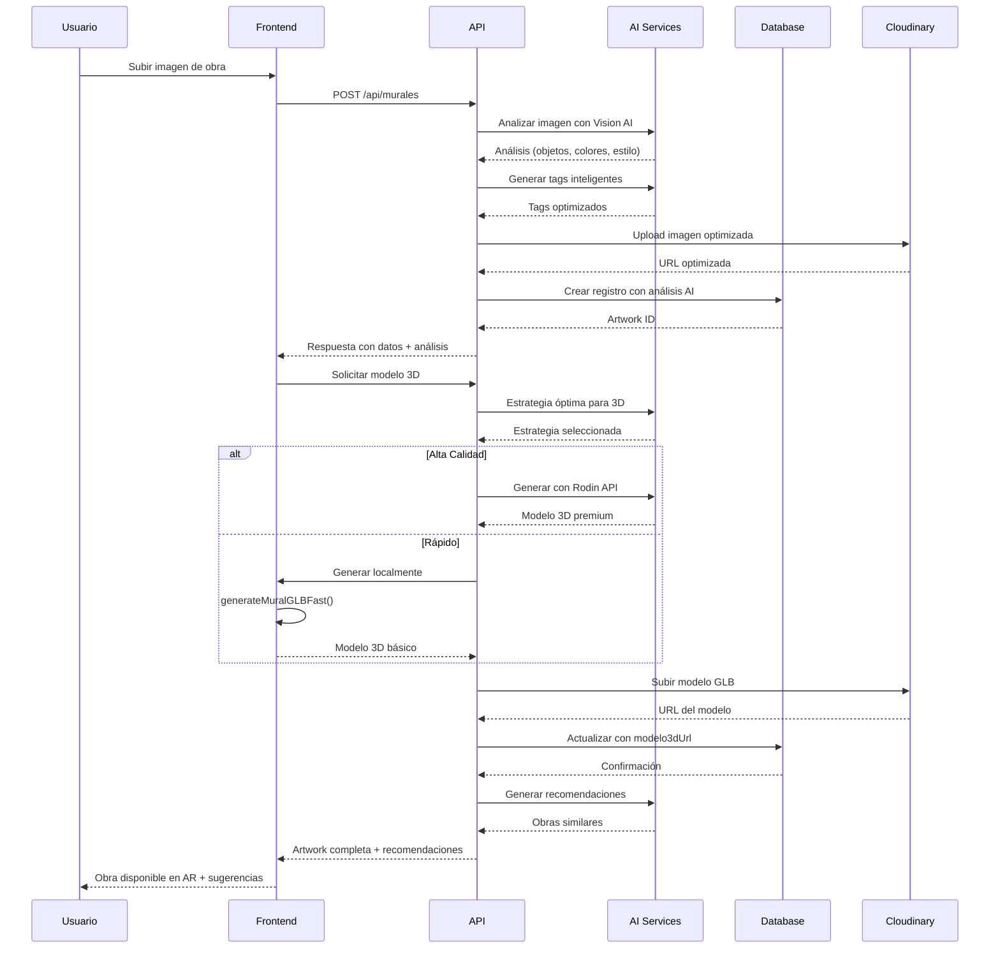
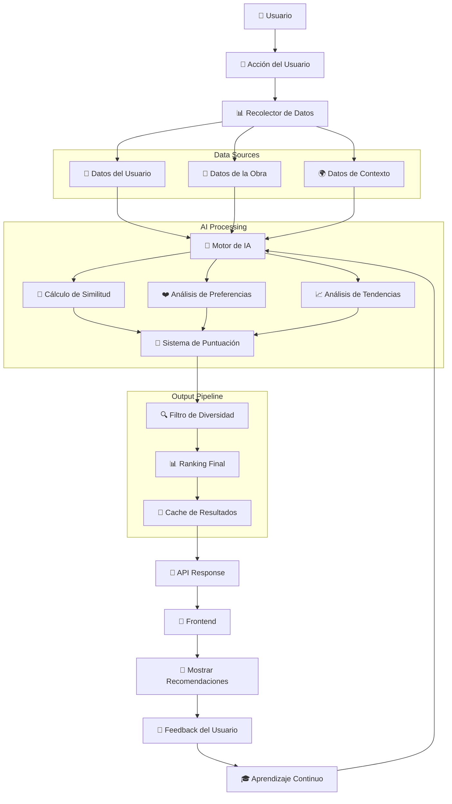
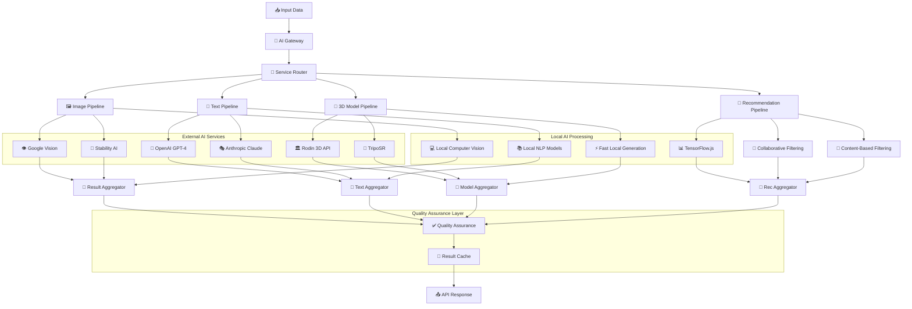
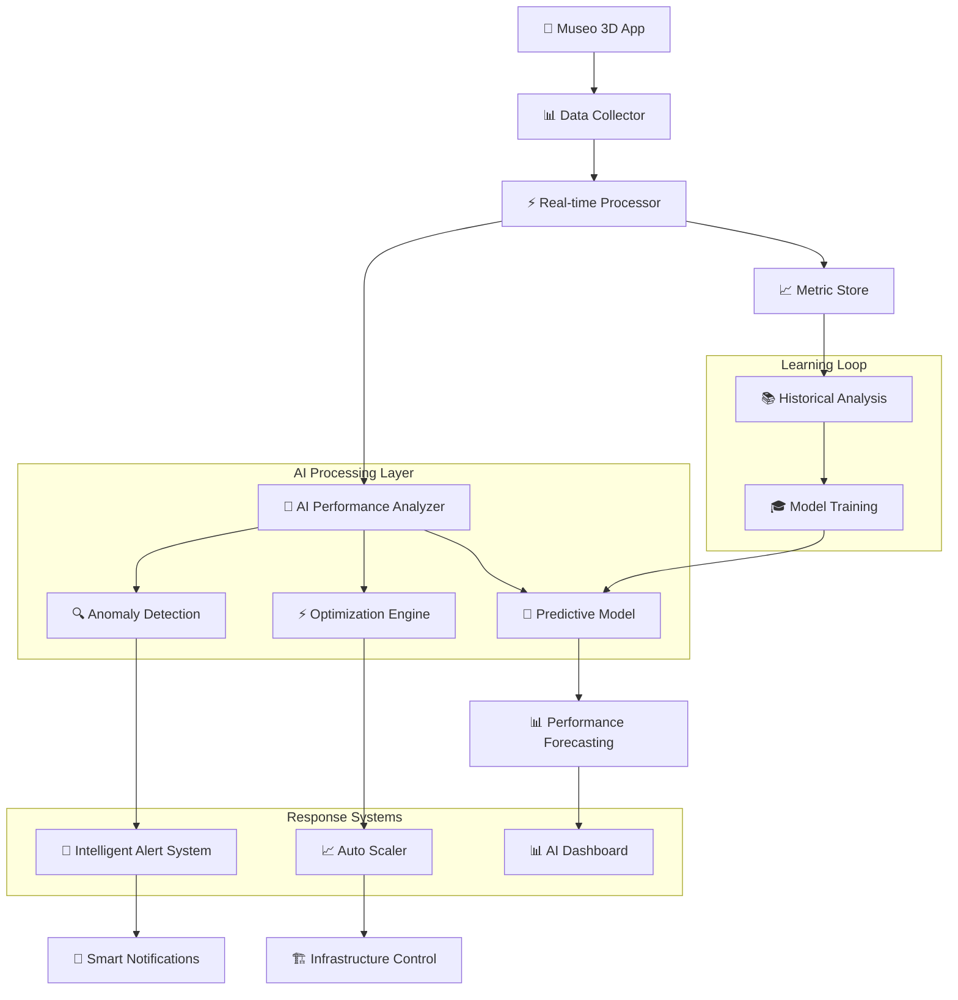

# 🏗️ Arquitectura del Sistema - Museo Virtual 3D

## 📋 Índice

1. [Visión General](#visión-general)
2. [Arquitectura de Alto Nivel](#arquitectura-de-alto-nivel)
3. [Stack Tecnológico](#stack-tecnológico)
4. [Arquitectura Frontend](#arquitectura-frontend)
5. [Arquitectura Backend](#arquitectura-backend)
6. [Base de Datos](#base-de-datos)
7. [Servicios Externos](#servicios-externos)
8. [Patrones de Diseño](#patrones-de-diseño)
9. [Flujo de Datos](#flujo-de-datos)
10. [Seguridad](#seguridad)
11. [Performance](#performance)
12. [Escalabilidad](#escalabilidad)

## 🎯 Visión General

El **Museo Virtual 3D** es una aplicación web progresiva (PWA) que proporciona experiencias inmersivas de arte digital mediante tecnologías 3D, Realidad Aumentada (AR) y gestión colaborativa de contenido.

### Principios Arquitectónicos

- **Modularity**: Componentes reutilizables y servicios independientes
- **Scalability**: Diseño horizontal y vertical
- **Performance**: Optimización de imágenes, lazy loading, y caching
- **Security**: Autenticación robusta y autorización granular
- **Maintainability**: Código limpio y documentación completa

## 🏛️ Arquitectura de Alto Nivel



## 🛠️ Stack Tecnológico

### Frontend Core

```typescript
// Framework Principal
Next.js 15.3.5 (App Router)
├── React 18+ (Server/Client Components)
├── TypeScript (Type Safety)
└── Tailwind CSS (Styling)

// 3D & AR Technologies
Three.js + React Three Fiber
├── @react-three/fiber (React Integration)
├── @react-three/drei (Helpers & Controls)
└── WebXR API (AR Experiences)

// Estado y Datos
React Context API
├── AuthProvider (Autenticación)
├── GalleryProvider (Galerías)
├── CollectionProvider (Colecciones)
├── ThemeProvider (Temas)
└── UserProvider (Usuario)
```

### Backend & Database

```sql
-- API Layer
Next.js API Routes
├── REST Endpoints
├── File Upload Handlers
└── Authentication Middleware

-- ORM & Database
Prisma ORM
├── PostgreSQL (Primary DB)
├── Schema Migrations
└── Type-safe Queries

-- Authentication
NextAuth.js
├── JWT Strategy
├── Google OAuth
├── Credentials Provider
└── Session Management
```

### Servicios Externos

```yaml
# Media & CDN
Cloudinary:
  - Image optimization
  - 3D model storage
  - Video streaming
  - Auto-format delivery

# Monitoring & Analytics
Sentry:
  - Error tracking
  - Performance monitoring
  - User session tracking
  - Real-time alerts

# Notifications
Web Push API:
  - Browser notifications
  - User engagement
  - Real-time updates
```

## 🎨 Arquitectura Frontend

### Estructura de Directorios

```
app/                          # Next.js App Router
├── (auth)/                   # Auth Routes Group
├── admin/                    # Admin Panel
├── api/                      # API Routes
├── galeria/                  # Gallery Views
├── museo/                    # Museum Main
├── perfil/                   # User Profile
└── globals.css               # Global Styles

components/                   # Shared Components
├── gallery/                  # Gallery Components
│   ├── MuralCard.jsx        # Main Card Component
│   ├── GalleryRoom.jsx      # 3D Gallery
│   └── EnhancedGallery.jsx  # Advanced Features
├── ar/                      # AR Components
├── ui/                      # UI Components
└── shared/                  # Shared Utilities

providers/                   # Context Providers
├── AuthProvider.jsx
├── GalleryProvider.jsx
├── CollectionProvider.jsx
└── ThemeProvider.jsx

hooks/                       # Custom Hooks
├── useGalleryTextures.js
├── useTextureOptimization.js
└── useGLBValidation.js

utils/                       # Utility Functions
├── generateMuralGLBFast.js
├── uploadToCloudinary.js
└── imageOptimization.js
```

### Patrón de Componentes

#### 1. **Component Composition Pattern**

```jsx
// MuralCard.jsx - Ejemplo de composición
const MuralCard = forwardRef(function MuralCard(
  { mural, onClick, onLike, isLiked, view = "grid", onARClick },
  ref
) {
  // Lógica del componente
  const hasModel3D = Boolean(localMuralData.modelo3dUrl);

  // Renderizado condicional basado en vista
  if (view === "list") {
    return <ListViewComponent />;
  }

  return <GridViewComponent />;
});
```

#### 2. **Provider Pattern**

```jsx
// AuthProvider.jsx - Gestión de estado global
export function AuthProvider({ children }) {
  const [user, setUser] = useState(null);
  const [session, setSession] = useState(null);

  const contextValue = {
    user,
    session,
    isAuthenticated: !!session,
    isAdmin: user?.role === "ADMIN",
  };

  return (
    <AuthContext.Provider value={contextValue}>{children}</AuthContext.Provider>
  );
}
```

#### 3. **Custom Hooks Pattern**

```javascript
// useGalleryTextures.js - Hook especializado
export function useGalleryTextures() {
  const [textures, setTextures] = useState({});
  const [loading, setLoading] = useState(true);

  const loadTexture = useCallback(async (url) => {
    // Lógica de carga optimizada
  }, []);

  return { textures, loading, loadTexture };
}
```

### Optimización de Performance Frontend

#### Image Optimization

```jsx
// OptimizedImage.jsx - Componente optimizado
const OptimizedImage = ({ src, alt, quality = 75, ...props }) => {
  const artPlaceholder = "data:image/jpeg;base64,/9j/4AAQ..."; // Base64 placeholder

  const getQuality = (size) => {
    if (size < 200) return 60;
    if (size < 500) return 70;
    return 75;
  };

  return (
    <Image
      src={src}
      alt={alt}
      quality={getQuality(props.width || 300)}
      placeholder="blur"
      blurDataURL={artPlaceholder}
      onError={handleError}
      {...props}
    />
  );
};
```

#### 3D Asset Management

```javascript
// GLB Fast Generation
export async function generateMuralGLBFast(imageUrl) {
  const scene = new THREE.Scene();
  const texture = await loadOptimizedTexture(imageUrl);

  // Crear geometría optimizada
  const geometry = new THREE.PlaneGeometry(width, height);
  const material = new THREE.MeshStandardMaterial({
    map: texture,
    transparent: true,
  });

  // Exportar con compresión
  const exporter = new GLTFExporter();
  return await exportCompressed(scene);
}
```

## ⚙️ Arquitectura Backend

### API Routes Structure

```
api/
├── auth/                    # Authentication
│   ├── [...nextauth]/       # NextAuth handlers
│   └── register/            # User registration
├── murales/                 # Artwork management
│   ├── [id]/               # Individual artwork
│   └── [id]/modelo3d/      # 3D model upload
├── salas/                  # Room management
│   ├── [id]/               # Individual room
│   └── [id]/murales/       # Room artworks
├── usuarios/               # User management
│   ├── [id]/               # User profile
│   └── [id]/collection/    # User collection
├── admin/                  # Admin endpoints
└── upload/                 # File upload handler
```

### Middleware Stack

```javascript
// middleware.js - Request processing pipeline
export function middleware(request) {
  // 1. CORS handling
  const response = handleCORS(request);

  // 2. Authentication check
  if (protectedRoutes.includes(pathname)) {
    return checkAuthentication(request);
  }

  // 3. Rate limiting
  if (apiRoutes.includes(pathname)) {
    return applyRateLimit(request);
  }

  // 4. Security headers
  return addSecurityHeaders(response);
}
```

### Data Access Layer

```typescript
// Prisma Schema Example
model Mural {
  id                  Int      @id @default(autoincrement())
  titulo              String
  descripcion         String?
  url_imagen          String?
  modelo3dUrl         String?  // 3D model URL
  userId              String?
  user                User?    @relation(fields: [userId], references: [id])
  salas              SalaMural[]
  favoritedBy        UserMuralFavorite[]
  createdAt          DateTime @default(now())
  updatedAt          DateTime @updatedAt
}

model User {
  id                 String   @id @default(cuid())
  name               String?
  email              String   @unique
  role               UserRole @default(USER)
  murales            Mural[]
  salasPropias       Sala[]   @relation("SalaOwner")
  favoritedBy        UserMuralFavorite[]
}
```

## 🗄️ Base de Datos

### Esquema Relacional

```sql
-- Entidades Principales
Users (Authentication & Profiles)
├── id (CUID Primary Key)
├── email (Unique)
├── role (ENUM: USER, ADMIN, ARTIST, CURATOR)
└── settings (JSON)

Murales (Artworks)
├── id (Auto-increment)
├── titulo, descripcion
├── url_imagen, modelo3dUrl
├── userId (Foreign Key)
└── geolocation (lat, lng)

Salas (Rooms/Galleries)
├── id (Auto-increment)
├── nombre, descripcion
├── creadorId (Foreign Key)
├── publica (Boolean)
└── layout_settings (JSON)

-- Relaciones Many-to-Many
SalaMural (Room-Artwork Junction)
UserMuralFavorite (User Favorites)
SalaColaborador (Room Collaborators)
```

### Índices y Optimización

```sql
-- Performance Indexes
CREATE INDEX idx_mural_userid ON Mural(userId);
CREATE INDEX idx_mural_publica ON Mural(publica) WHERE publica = true;
CREATE INDEX idx_sala_creador ON Sala(creadorId);
CREATE INDEX idx_user_email ON User(email);

-- Full-text Search
CREATE INDEX idx_mural_search ON Mural USING GIN(to_tsvector('spanish', titulo || ' ' || descripcion));
```

## 🌐 Servicios Externos

### Cloudinary Integration

```javascript
// uploadToCloudinary.js
export async function uploadModelToCloudinary(file, fileName) {
  const formData = new FormData();
  formData.append("file", file);
  formData.append("upload_preset", "museo3d_models");
  formData.append("resource_type", "raw");
  formData.append("public_id", fileName);

  const response = await fetch(
    `https://api.cloudinary.com/v1_1/${cloudName}/raw/upload`,
    { method: "POST", body: formData }
  );

  return response.secure_url;
}
```

### Sentry Monitoring

```javascript
// sentryLogger.js
export const SentryLogger = {
  userLogin: (userId, email, method) => {
    Sentry.captureMessage(`Usuario autenticado: ${email}`, {
      level: "info",
      tags: { action: "user_login", method },
      user: { id: userId, email },
    });
  },

  galleryView: (userId, salaId, salaName) => {
    Sentry.captureMessage(`Galería visitada: ${salaName}`, {
      level: "info",
      tags: { action: "gallery_view" },
      extra: { salaId, timestamp: new Date().toISOString() },
    });
  },
};
```

## 🤖 Integración de Modelos de IA

### Arquitectura de IA con Hugging Face

```mermaid
graph TB
    User[👤 Usuario] --> Frontend[🎨 Next.js Frontend]
    Frontend --> AIGateway[🧠 AI Gateway Router]

    AIGateway --> ImagePipeline[🖼️ Image Processing Pipeline]
    AIGateway --> TextPipeline[📝 Text Processing Pipeline]
    AIGateway --> Model3DPipeline[🎯 3D Generation Pipeline]
    AIGateway --> RecommendPipeline[🎪 Recommendation Pipeline]

    %% Image Processing with Hugging Face
    ImagePipeline --> HFVision[🤗 Hugging Face Vision Models]
    ImagePipeline --> CloudVision[�️ Google Vision API]
    ImagePipeline --> StabilityAI[🎨 Stability AI]

    HFVision --> CLIP[📎 CLIP (Image-Text)]
    HFVision --> BLIP[🔍 BLIP-2 (Image Captioning)]
    HFVision --> YOLO[🎯 YOLO (Object Detection)]
    HFVision --> SAM[✂️ SAM (Segmentation)]

    %% Text Processing with Hugging Face
    TextPipeline --> HFText[🤗 Hugging Face NLP Models]
    TextPipeline --> OpenAI[🔮 OpenAI GPT-4]
    TextPipeline --> Claude[🎭 Anthropic Claude]

    HFText --> BERT[📚 BERT (Classification)]
    HFText --> T5[📝 T5 (Text Generation)]
    HFText --> Llama[🦙 Llama-2 (Chat)]
    HFText --> Mistral[⚡ Mistral-7B (Fast Generation)]

    %% 3D Model Generation
    Model3DPipeline --> HF3D[🤗 Hugging Face 3D Models]
    Model3DPipeline --> RodinAPI[🏛️ Rodin 3D API]
    Model3DPipeline --> LocalGeneration[💻 Local Fast Generation]

    HF3D --> Shap-E[🌐 Shap-E (Text-to-3D)]
    HF3D --> TripoSR[🎲 TripoSR (Image-to-3D)]
    HF3D --> Point-E[� Point-E (Point Clouds)]

    %% Recommendation System
    RecommendPipeline --> HFRec[🤗 Hugging Face Recommendation]
    RecommendPipeline --> TensorFlowJS[📊 TensorFlow.js Local]
    RecommendPipeline --> CollaborativeFilter[👥 Collaborative Filtering]

    HFRec --> SentenceTransformers[🔗 Sentence Transformers]
    HFRec --> FAISS[� FAISS Similarity Search]

    %% Integration Points in App
    Frontend --> Components[🎨 App Components]
    Components --> GalleryView[🖼️ Gallery Components]
    Components --> ARExperience[📱 AR/VR Components]
    Components --> ChatBot[🤖 AI Chatbot]
    Components --> AdminPanel[⚙️ Admin Dashboard]

    GalleryView --> ImageAnalysis{🔍 Real-time Analysis}
    ARExperience --> Model3DGen{🎯 3D Model Generation}
    ChatBot --> TextProcessing{💬 Natural Language}
    AdminPanel --> Analytics{📊 Content Analytics}

    ImageAnalysis --> HFVision
    Model3DGen --> HF3D
    TextProcessing --> HFText
    Analytics --> HFRec

    %% Model Deployment
    subgraph "🤗 Hugging Face Hub"
        ModelHub[Model Repository]
        ModelInference[Inference API]
        ModelSpaces[Spaces Deployment]
    end

    HFVision --> ModelHub
    HFText --> ModelHub
    HF3D --> ModelHub
    HFRec --> ModelHub

    ModelHub --> ModelInference
    ModelInference --> ModelSpaces

    %% Local Deployment
    subgraph "💻 Local Processing"
        LocalModels[Local HF Models]
        EdgeInference[Edge Inference]
        CacheLayer[Model Cache]
    end

    Frontend --> LocalModels
    LocalModels --> EdgeInference
    EdgeInference --> CacheLayer

    %% API Integration Points
    subgraph "🔌 API Routes Integration"
        VisionAPI[/api/ai/vision]
        TextAPI[/api/ai/text]
        Model3DAPI[/api/ai/3d-generation]
        RecommendAPI[/api/ai/recommendations]
        ChatAPI[/api/ai/chat]
    end

    Components --> VisionAPI
    Components --> TextAPI
    Components --> Model3DAPI
    Components --> RecommendAPI
    Components --> ChatAPI

    VisionAPI --> ImagePipeline
    TextAPI --> TextPipeline
    Model3DAPI --> Model3DPipeline
    RecommendAPI --> RecommendPipeline
    ChatAPI --> TextPipeline

    %% External Services
    subgraph "☁️ External AI Services"
        OpenAI
        Claude
        StabilityAI
        RodinAPI
        CloudVision
    end

    %% Performance & Monitoring
    subgraph "📈 Monitoring & Analytics"
        ModelMetrics[Model Performance]
        UsageAnalytics[Usage Analytics]
        CostOptimization[Cost Optimization]
    end

    AIGateway --> ModelMetrics
    ModelMetrics --> UsageAnalytics
    UsageAnalytics --> CostOptimization
```

### 1. **Servicios de Hugging Face Integration**

```javascript
// services/huggingFaceService.js
export class HuggingFaceService {
  constructor() {
    this.apiKey = process.env.HUGGINGFACE_API_KEY;
    this.baseUrl = "https://api-inference.huggingface.co/models";
    this.localModels = new Map();
  }

  // Análisis de imágenes con modelos de Hugging Face
  async analyzeImageWithCLIP(imageUrl, textPrompts) {
    try {
      const response = await fetch(
        `${this.baseUrl}/openai/clip-vit-large-patch14`,
        {
          method: "POST",
          headers: {
            Authorization: `Bearer ${this.apiKey}`,
            "Content-Type": "application/json",
          },
          body: JSON.stringify({
            inputs: {
              image: await this.imageToBase64(imageUrl),
              text: textPrompts,
            },
          }),
        }
      );

      const results = await response.json();
      return this.processClipResults(results, textPrompts);
    } catch (error) {
      console.error("CLIP analysis failed:", error);
      return this.getFallbackImageAnalysis(imageUrl);
    }
  }

  // Generación de descripciones con BLIP-2
  async generateImageCaption(imageUrl) {
    try {
      const response = await fetch(
        `${this.baseUrl}/Salesforce/blip-image-captioning-large`,
        {
          method: "POST",
          headers: {
            Authorization: `Bearer ${this.apiKey}`,
            "Content-Type": "application/json",
          },
          body: JSON.stringify({
            inputs: await this.imageToBase64(imageUrl),
          }),
        }
      );

      const result = await response.json();
      return {
        caption: result[0].generated_text,
        confidence: result[0].score || 0.8,
        model: "blip-2",
      };
    } catch (error) {
      console.error("BLIP caption generation failed:", error);
      return { caption: "Artwork analysis unavailable", confidence: 0.0 };
    }
  }

  // Detección de objetos con YOLO
  async detectObjects(imageUrl) {
    try {
      const response = await fetch(`${this.baseUrl}/facebook/detr-resnet-50`, {
        method: "POST",
        headers: {
          Authorization: `Bearer ${this.apiKey}`,
          "Content-Type": "application/json",
        },
        body: JSON.stringify({
          inputs: await this.imageToBase64(imageUrl),
        }),
      });

      const detections = await response.json();
      return detections.map((detection) => ({
        label: detection.label,
        confidence: detection.score,
        box: detection.box,
      }));
    } catch (error) {
      console.error("Object detection failed:", error);
      return [];
    }
  }

  // Generación de texto con Llama
  async generateTextWithLlama(prompt, context = {}) {
    try {
      const response = await fetch(
        `${this.baseUrl}/meta-llama/Llama-2-7b-chat-hf`,
        {
          method: "POST",
          headers: {
            Authorization: `Bearer ${this.apiKey}`,
            "Content-Type": "application/json",
          },
          body: JSON.stringify({
            inputs: this.formatLlamaPrompt(prompt, context),
            parameters: {
              max_new_tokens: 512,
              temperature: 0.7,
              do_sample: true,
              return_full_text: false,
            },
          }),
        }
      );

      const result = await response.json();
      return {
        text: result[0].generated_text,
        model: "llama-2-7b",
        tokens: result[0].details?.tokens || 0,
      };
    } catch (error) {
      console.error("Llama text generation failed:", error);
      return {
        text: "No puedo generar respuesta en este momento",
        model: "fallback",
      };
    }
  }

  // Embeddings para recomendaciones
  async generateEmbeddings(texts) {
    try {
      const response = await fetch(
        `${this.baseUrl}/sentence-transformers/all-MiniLM-L6-v2`,
        {
          method: "POST",
          headers: {
            Authorization: `Bearer ${this.apiKey}`,
            "Content-Type": "application/json",
          },
          body: JSON.stringify({
            inputs: Array.isArray(texts) ? texts : [texts],
            options: { wait_for_model: true },
          }),
        }
      );

      const embeddings = await response.json();
      return embeddings;
    } catch (error) {
      console.error("Embedding generation failed:", error);
      return null;
    }
  }

  // Generación 3D con modelos locales de Hugging Face
  async generate3DFromImage(imageUrl, options = {}) {
    try {
      // Usar TripoSR desde Hugging Face
      const response = await fetch(`${this.baseUrl}/stabilityai/TripoSR`, {
        method: "POST",
        headers: {
          Authorization: `Bearer ${this.apiKey}`,
          "Content-Type": "application/json",
        },
        body: JSON.stringify({
          inputs: await this.imageToBase64(imageUrl),
          parameters: {
            num_inference_steps: options.quality === "high" ? 50 : 20,
            guidance_scale: 7.5,
          },
        }),
      });

      if (response.ok) {
        const blob = await response.blob();
        return await this.processGenerated3D(blob);
      } else {
        // Fallback a generación local rápida
        return await this.generateLocalFast3D(imageUrl);
      }
    } catch (error) {
      console.error("3D generation with HuggingFace failed:", error);
      return await this.generateLocalFast3D(imageUrl);
    }
  }

  // Utilidades
  async imageToBase64(imageUrl) {
    const response = await fetch(imageUrl);
    const buffer = await response.arrayBuffer();
    return Buffer.from(buffer).toString("base64");
  }

  formatLlamaPrompt(prompt, context) {
    return `<s>[INST] <<SYS>>
Eres un asistente especializado en arte y museos virtuales. Ayudas a los usuarios a explorar galerías y proporcionar información cultural relevante.

Contexto: ${JSON.stringify(context)}
<</SYS>>

${prompt} [/INST]`;
  }

  processClipResults(results, prompts) {
    return prompts.map((prompt, index) => ({
      text: prompt,
      similarity: results[index],
      relevant: results[index] > 0.3,
    }));
  }
}
```

### 2. **Integración en Componentes de la App**

```javascript
// components/ai/AIArtworkAnalyzer.jsx
export function AIArtworkAnalyzer({ imageUrl, onAnalysisComplete }) {
  const [analysis, setAnalysis] = useState(null);
  const [loading, setLoading] = useState(false);
  const hfService = new HuggingFaceService();

  const analyzeArtwork = async () => {
    setLoading(true);

    try {
      // Análisis paralelo con múltiples modelos de Hugging Face
      const [clipResults, caption, objects, tags] = await Promise.all([
        hfService.analyzeImageWithCLIP(imageUrl, [
          "abstract art",
          "portrait",
          "landscape",
          "sculpture",
          "modern art",
          "classical art",
          "digital art",
        ]),
        hfService.generateImageCaption(imageUrl),
        hfService.detectObjects(imageUrl),
        hfService.generateSmartTags(imageUrl),
      ]);

      const analysisResult = {
        style: clipResults.find((r) => r.relevant)?.text || "unknown",
        description: caption.caption,
        objects: objects.filter((obj) => obj.confidence > 0.5),
        tags: tags,
        confidence: caption.confidence,
        timestamp: Date.now(),
      };

      setAnalysis(analysisResult);
      onAnalysisComplete?.(analysisResult);
    } catch (error) {
      console.error("Artwork analysis failed:", error);
    } finally {
      setLoading(false);
    }
  };

  useEffect(() => {
    if (imageUrl) {
      analyzeArtwork();
    }
  }, [imageUrl]);

  if (loading) {
    return <AIAnalysisLoader />;
  }

  return (
    <div className="ai-artwork-analyzer">
      {analysis && (
        <div className="analysis-results">
          <div className="style-detection">
            <h3>Estilo Detectado</h3>
            <span className="style-tag">{analysis.style}</span>
          </div>

          <div className="description">
            <h3>Descripción Generada</h3>
            <p>{analysis.description}</p>
          </div>

          <div className="objects-detected">
            <h3>Objetos Detectados</h3>
            <div className="object-tags">
              {analysis.objects.map((obj, idx) => (
                <span key={idx} className="object-tag">
                  {obj.label} ({Math.round(obj.confidence * 100)}%)
                </span>
              ))}
            </div>
          </div>

          <div className="smart-tags">
            <h3>Tags Inteligentes</h3>
            <div className="tag-cloud">
              {analysis.tags.map((tag, idx) => (
                <span key={idx} className="smart-tag">
                  {tag}
                </span>
              ))}
            </div>
          </div>
        </div>
      )}
    </div>
  );
}
```

### 3. **Chat Bot con Llama Integration**

```javascript
// components/ai/MuseumChatBot.jsx
export function MuseumChatBot() {
  const [messages, setMessages] = useState([]);
  const [isTyping, setIsTyping] = useState(false);
  const hfService = new HuggingFaceService();

  const sendMessage = async (userMessage) => {
    const userMsg = {
      role: "user",
      content: userMessage,
      timestamp: Date.now(),
    };
    setMessages((prev) => [...prev, userMsg]);
    setIsTyping(true);

    try {
      // Contexto del museo
      const context = {
        currentGallery: "Galería Principal",
        artworkCount: 150,
        userInterests: ["arte moderno", "impresionismo"],
        conversationHistory: messages.slice(-6),
      };

      // Generar respuesta con Llama
      const response = await hfService.generateTextWithLlama(
        userMessage,
        context
      );

      const botMsg = {
        role: "assistant",
        content: response.text,
        model: response.model,
        timestamp: Date.now(),
      };

      setMessages((prev) => [...prev, botMsg]);
    } catch (error) {
      console.error("Chat failed:", error);
      const errorMsg = {
        role: "assistant",
        content:
          "Lo siento, no puedo responder en este momento. ¿Podrías intentar de nuevo?",
        timestamp: Date.now(),
      };
      setMessages((prev) => [...prev, errorMsg]);
    } finally {
      setIsTyping(false);
    }
  };

  return (
    <div className="museum-chatbot">
      <div className="chat-header">
        <h3>🤖 Asistente del Museo</h3>
        <span className="powered-by">Powered by Llama-2</span>
      </div>

      <div className="chat-messages">
        {messages.map((msg, idx) => (
          <ChatMessage key={idx} message={msg} />
        ))}
        {isTyping && <TypingIndicator />}
      </div>

      <ChatInput onSend={sendMessage} disabled={isTyping} />
    </div>
  );
}
```

### 4. **Sistema de Recomendaciones con Sentence Transformers**

```javascript
// services/aiRecommendations.js
export class HuggingFaceRecommendationEngine {
  constructor() {
    this.hfService = new HuggingFaceService();
    this.embeddingCache = new Map();
    this.similarityThreshold = 0.7;
  }

  async getSmartRecommendations(currentArtwork, userHistory = [], limit = 6) {
    try {
      // Generar embedding de la obra actual
      const currentEmbedding = await this.getArtworkEmbedding(currentArtwork);

      // Obtener todas las obras disponibles
      const allArtworks = await this.getAllArtworks();

      // Calcular similitudes usando embeddings
      const similarities = await this.calculateSimilarities(
        currentEmbedding,
        allArtworks
      );

      // Aplicar filtros de diversidad y preferencias del usuario
      const recommendations = this.applyIntelligentFiltering(
        similarities,
        userHistory,
        limit
      );

      return recommendations;
    } catch (error) {
      console.error("HuggingFace recommendations failed:", error);
      return this.getFallbackRecommendations(currentArtwork, limit);
    }
  }

  async getArtworkEmbedding(artwork) {
    const cacheKey = `artwork_${artwork.id}`;

    if (this.embeddingCache.has(cacheKey)) {
      return this.embeddingCache.get(cacheKey);
    }

    // Crear texto descriptivo para embedding
    const descriptiveText = this.createDescriptiveText(artwork);

    // Generar embedding con Sentence Transformers
    const embedding = await this.hfService.generateEmbeddings(descriptiveText);

    this.embeddingCache.set(cacheKey, embedding);
    return embedding;
  }

  createDescriptiveText(artwork) {
    return [
      artwork.titulo,
      artwork.descripcion,
      artwork.tecnica,
      artwork.estilo,
      ...(artwork.tags || []),
    ]
      .filter(Boolean)
      .join(". ");
  }

  async calculateSimilarities(currentEmbedding, artworks) {
    const similarities = [];

    for (const artwork of artworks) {
      const artworkEmbedding = await this.getArtworkEmbedding(artwork);
      const similarity = this.cosineSimilarity(
        currentEmbedding,
        artworkEmbedding
      );

      similarities.push({
        artwork,
        similarity,
        reasons: this.generateRecommendationReasons(similarity),
      });
    }

    return similarities.sort((a, b) => b.similarity - a.similarity);
  }

  cosineSimilarity(a, b) {
    const dotProduct = a.reduce((sum, ai, i) => sum + ai * b[i], 0);
    const magnitudeA = Math.sqrt(a.reduce((sum, ai) => sum + ai * ai, 0));
    const magnitudeB = Math.sqrt(b.reduce((sum, bi) => sum + bi * bi, 0));
    return dotProduct / (magnitudeA * magnitudeB);
  }
}
```

### 5. **API Routes para Hugging Face Integration**

```javascript
// app/api/ai/huggingface/vision/route.js
export async function POST(req) {
  try {
    const { imageUrl, analysisType } = await req.json();
    const hfService = new HuggingFaceService();

    let result;

    switch (analysisType) {
      case "clip":
        const prompts = ["abstract art", "portrait", "landscape", "modern art"];
        result = await hfService.analyzeImageWithCLIP(imageUrl, prompts);
        break;

      case "caption":
        result = await hfService.generateImageCaption(imageUrl);
        break;

      case "objects":
        result = await hfService.detectObjects(imageUrl);
        break;

      case "complete":
        // Análisis completo con múltiples modelos
        const [clipResults, caption, objects] = await Promise.all([
          hfService.analyzeImageWithCLIP(imageUrl, [
            "abstract art",
            "portrait",
            "landscape",
            "sculpture",
          ]),
          hfService.generateImageCaption(imageUrl),
          hfService.detectObjects(imageUrl),
        ]);

        result = {
          styleAnalysis: clipResults,
          description: caption,
          objectDetection: objects,
          processingTime: Date.now(),
        };
        break;

      default:
        throw new Error(`Unknown analysis type: ${analysisType}`);
    }

    return Response.json({
      success: true,
      data: result,
      model: "huggingface",
      timestamp: Date.now(),
    });
  } catch (error) {
    console.error("HuggingFace vision analysis failed:", error);
    return Response.json(
      {
        error: "Vision analysis failed",
        details: error.message,
        fallback: true,
      },
      { status: 500 }
    );
  }
}

// app/api/ai/huggingface/chat/route.js
export async function POST(req) {
  try {
    const { message, context, model = "llama" } = await req.json();
    const hfService = new HuggingFaceService();

    // Preparar contexto del museo
    const museumContext = {
      currentGallery: context?.gallery || "Galería Principal",
      artworkCount: context?.artworkCount || 150,
      userPreferences: context?.preferences || [],
      conversationHistory: context?.history || [],
    };

    let response;

    switch (model) {
      case "llama":
        response = await hfService.generateTextWithLlama(
          message,
          museumContext
        );
        break;

      case "mistral":
        response = await hfService.generateTextWithMistral(
          message,
          museumContext
        );
        break;

      default:
        throw new Error(`Unknown model: ${model}`);
    }

    // Detectar si necesita acciones específicas
    const actions = await detectActionIntent(message, response.text);

    return Response.json({
      message: response.text,
      model: response.model,
      actions: actions,
      metadata: {
        tokens: response.tokens,
        processingTime: Date.now() - req.startTime,
      },
    });
  } catch (error) {
    console.error("HuggingFace chat failed:", error);
    return Response.json(
      {
        error: "Chat processing failed",
        message: "Lo siento, no puedo responder en este momento.",
        model: "fallback",
      },
      { status: 500 }
    );
  }
}

// app/api/ai/huggingface/3d-generation/route.js
export async function POST(req) {
  try {
    const {
      imageUrl,
      quality = "medium",
      style = "museum_frame",
    } = await req.json();
    const hfService = new HuggingFaceService();

    // Intentar generar con TripoSR desde Hugging Face
    const model3D = await hfService.generate3DFromImage(imageUrl, {
      quality,
      style,
      format: "glb",
    });

    if (model3D && model3D.success) {
      // Subir a Cloudinary
      const cloudinaryUrl = await uploadToCloudinary(
        model3D.data,
        `model3d_${Date.now()}.glb`
      );

      return Response.json({
        success: true,
        model3dUrl: cloudinaryUrl,
        generationMethod: "huggingface_triposr",
        quality: quality,
        processingTime: model3D.processingTime,
      });
    } else {
      // Fallback a generación local
      const localModel = await generateMuralGLBFast(imageUrl);

      return Response.json({
        success: true,
        model3dUrl: localModel.url,
        generationMethod: "local_fallback",
        quality: "basic",
      });
    }
  } catch (error) {
    console.error("3D generation failed:", error);
    return Response.json(
      { error: "3D generation failed", details: error.message },
      { status: 500 }
    );
  }
}

// app/api/ai/huggingface/recommendations/route.js
export async function POST(req) {
  try {
    const { artworkId, userId, limit = 6 } = await req.json();
    const hfService = new HuggingFaceService();
    const recEngine = new HuggingFaceRecommendationEngine();

    // Obtener obra actual
    const currentArtwork = await prisma.mural.findUnique({
      where: { id: artworkId },
      include: { user: true },
    });

    // Obtener historial del usuario
    const userHistory = userId ? await getUserArtworkHistory(userId) : [];

    // Generar recomendaciones con embeddings
    const recommendations = await recEngine.getSmartRecommendations(
      currentArtwork,
      userHistory,
      limit
    );

    // Enriquecer con datos adicionales
    const enrichedRecommendations = await Promise.all(
      recommendations.map(async (rec) => ({
        ...rec.artwork,
        similarity: rec.similarity,
        reasons: rec.reasons,
        aiGenerated: true,
        model: "sentence-transformers",
      }))
    );

    return Response.json({
      recommendations: enrichedRecommendations,
      metadata: {
        baseArtwork: currentArtwork.titulo,
        algorithmUsed: "huggingface_embeddings",
        processingTime: Date.now(),
      },
    });
  } catch (error) {
    console.error("HuggingFace recommendations failed:", error);
    return Response.json(
      { error: "Recommendations failed", details: error.message },
      { status: 500 }
    );
  }
}

// Utility function for action detection
async function detectActionIntent(message, response) {
  const actions = [];

  // Detectar intenciones comunes
  if (
    message.toLowerCase().includes("mostrar") ||
    message.toLowerCase().includes("ver")
  ) {
    if (message.includes("galería") || message.includes("sala")) {
      actions.push({ type: "navigate_gallery", target: "main" });
    }
    if (message.includes("obra") || message.includes("arte")) {
      actions.push({ type: "show_artwork_grid" });
    }
  }

  if (
    message.toLowerCase().includes("realidad aumentada") ||
    message.toLowerCase().includes("ar")
  ) {
    actions.push({ type: "start_ar_experience" });
  }

  if (
    message.toLowerCase().includes("recomendar") ||
    message.toLowerCase().includes("similar")
  ) {
    actions.push({ type: "show_recommendations" });
  }

  return actions;
}
```

### 6. **Configuración de Ambiente para Hugging Face**

```javascript
// next.config.mjs - Configuración para Hugging Face
const nextConfig = {
  env: {
    HUGGINGFACE_API_KEY: process.env.HUGGINGFACE_API_KEY,
    HUGGINGFACE_MODELS_CACHE: process.env.HUGGINGFACE_MODELS_CACHE || "true",
  },

  experimental: {
    serverComponentsExternalPackages: ["@huggingface/inference"],
  },

  webpack: (config) => {
    // Optimización para modelos de ML
    config.resolve.fallback = {
      ...config.resolve.fallback,
      fs: false,
      net: false,
      tls: false,
    };

    return config;
  },
};

export default nextConfig;
```

### 7. **Hook Personalizado para Hugging Face**

```javascript
// hooks/useHuggingFaceAI.js
export function useHuggingFaceAI() {
  const [loading, setLoading] = useState(false);
  const [error, setError] = useState(null);
  const [cache, setCache] = useState(new Map());

  const analyzeImage = useCallback(
    async (imageUrl, analysisType = "complete") => {
      const cacheKey = `${imageUrl}_${analysisType}`;

      if (cache.has(cacheKey)) {
        return cache.get(cacheKey);
      }

      setLoading(true);
      setError(null);

      try {
        const response = await fetch("/api/ai/huggingface/vision", {
          method: "POST",
          headers: { "Content-Type": "application/json" },
          body: JSON.stringify({ imageUrl, analysisType }),
        });

        if (!response.ok) throw new Error("Analysis failed");

        const result = await response.json();
        cache.set(cacheKey, result);
        setCache(new Map(cache));

        return result;
      } catch (err) {
        setError(err.message);
        throw err;
      } finally {
        setLoading(false);
      }
    },
    [cache]
  );

  const chatWithAI = useCallback(async (message, context = {}) => {
    setLoading(true);
    setError(null);

    try {
      const response = await fetch("/api/ai/huggingface/chat", {
        method: "POST",
        headers: { "Content-Type": "application/json" },
        body: JSON.stringify({ message, context, model: "llama" }),
      });

      if (!response.ok) throw new Error("Chat failed");

      return await response.json();
    } catch (err) {
      setError(err.message);
      throw err;
    } finally {
      setLoading(false);
    }
  }, []);

  const generateRecommendations = useCallback(
    async (artworkId, userId = null) => {
      setLoading(true);
      setError(null);

      try {
        const response = await fetch("/api/ai/huggingface/recommendations", {
          method: "POST",
          headers: { "Content-Type": "application/json" },
          body: JSON.stringify({ artworkId, userId }),
        });

        if (!response.ok) throw new Error("Recommendations failed");

        return await response.json();
      } catch (err) {
        setError(err.message);
        throw err;
      } finally {
        setLoading(false);
      }
    },
    []
  );

  return {
    loading,
    error,
    analyzeImage,
    chatWithAI,
    generateRecommendations,
    clearCache: () => setCache(new Map()),
  };
}
```

async generateFromImage(imageUrl, options = {}) {
const {
style = 'museum_frame',
quality = 'high',
dimensions = { width: 2, height: 1.5, depth: 0.1 }
} = options;

    try {
      // 1. Análisis de imagen con Computer Vision
      const imageAnalysis = await this.analyzeImage(imageUrl);

      // 2. Generación de prompt optimizado
      const prompt = this.generateOptimizedPrompt(imageAnalysis, style);

      // 3. Generación 3D usando múltiples servicios
      const models = await Promise.allSettled([
        this.generateWithRodin(imageUrl, prompt),
        this.generateWithTripoSR(imageUrl, dimensions),
        this.generateLocalFast(imageUrl, style) // Fallback local
      ]);

      // 4. Seleccionar mejor resultado
      return this.selectBestModel(models);

    } catch (error) {
      console.error('AI 3D Generation failed:', error);
      // Fallback a generación local rápida
      return await generateMuralGLBFast(imageUrl);
    }

}

async analyzeImage(imageUrl) {
const response = await fetch('/api/ai/vision', {
method: 'POST',
headers: { 'Content-Type': 'application/json' },
body: JSON.stringify({
imageUrl,
features: ['objects', 'colors', 'composition', 'style']
})
});

    return await response.json();

}

generateOptimizedPrompt(analysis, style) {
const basePrompt = `Create a ${style} 3D model based on: `;
const details = [
`Main objects: ${analysis.objects.join(', ')}`,
`Color palette: ${analysis.colors.dominant.join(', ')}`,
`Art style: ${analysis.style.classification}`,
`Composition: ${analysis.composition.type}`
].join('. ');

    return basePrompt + details;

}
}

````

### 2. **Sistema de Recomendaciones Inteligente**
```javascript
// services/aiRecommendations.js
export class AIRecommendationEngine {
  constructor() {
    this.model = null;
    this.userEmbeddings = new Map();
    this.artworkEmbeddings = new Map();
  }

  async initialize() {
    // Cargar modelo TensorFlow.js pre-entrenado
    this.model = await tf.loadLayersModel('/models/recommendation-model.json');

    // Cargar embeddings pre-calculados
    await this.loadEmbeddings();
  }

  async getRecommendations(userId, currentArtworkId, limit = 6) {
    try {
      // 1. Obtener embedding del usuario
      const userVector = await this.getUserEmbedding(userId);

      // 2. Obtener contexto de la obra actual
      const artworkContext = await this.getArtworkContext(currentArtworkId);

      // 3. Calcular similitudes
      const similarities = this.calculateSimilarities(
        userVector,
        artworkContext,
        this.artworkEmbeddings
      );

      // 4. Aplicar filtros de diversidad
      const recommendations = this.diversityFilter(similarities, limit);

      // 5. Actualizar embeddings del usuario
      await this.updateUserEmbedding(userId, currentArtworkId);

      return recommendations;

    } catch (error) {
      console.error('AI Recommendations failed:', error);
      // Fallback a recomendaciones basadas en reglas
      return await this.getFallbackRecommendations(currentArtworkId, limit);
    }
  }

  async getUserEmbedding(userId) {
    if (this.userEmbeddings.has(userId)) {
      return this.userEmbeddings.get(userId);
    }

    // Generar embedding inicial basado en historial
    const userHistory = await this.getUserHistory(userId);
    const embedding = await this.generateUserEmbedding(userHistory);

    this.userEmbeddings.set(userId, embedding);
    return embedding;
  }

  calculateSimilarities(userVector, artworkContext, allEmbeddings) {
    const similarities = [];

    for (const [artworkId, embedding] of allEmbeddings) {
      // Combinar similitud de usuario y contexto
      const userSimilarity = this.cosineSimilarity(userVector, embedding);
      const contextSimilarity = this.cosineSimilarity(artworkContext, embedding);

      // Peso ponderado
      const finalScore = (userSimilarity * 0.7) + (contextSimilarity * 0.3);

      similarities.push({ artworkId, score: finalScore });
    }

    return similarities.sort((a, b) => b.score - a.score);
  }
}
````

### 3. **Análisis Inteligente de Contenido**

```javascript
// services/aiContentAnalysis.js
export class AIContentAnalyzer {
  async analyzeArtwork(artwork) {
    const analysis = {
      visual: await this.analyzeVisualContent(artwork.url_imagen),
      textual: await this.analyzeTextualContent(artwork),
      sentiment: await this.analyzeSentiment(artwork.descripcion),
      tags: await this.generateSmartTags(artwork),
      accessibility: await this.generateAccessibilityDesc(artwork.url_imagen),
    };

    return analysis;
  }

  async analyzeVisualContent(imageUrl) {
    const response = await fetch("/api/ai/vision/analyze", {
      method: "POST",
      headers: { "Content-Type": "application/json" },
      body: JSON.stringify({
        imageUrl,
        features: [
          "LABEL_DETECTION",
          "COLOR_PROPERTIES",
          "FACE_DETECTION",
          "OBJECT_LOCALIZATION",
          "TEXT_DETECTION",
        ],
      }),
    });

    const visionData = await response.json();

    return {
      objects: visionData.objects.map((obj) => ({
        name: obj.name,
        confidence: obj.confidence,
        boundingBox: obj.boundingPoly,
      })),
      colors: {
        dominant: visionData.colors.dominantColors,
        palette: visionData.colors.colorPalette,
      },
      faces: visionData.faces.length,
      text: visionData.textAnnotations,
      complexity: this.calculateVisualComplexity(visionData),
    };
  }

  async generateSmartTags(artwork) {
    const prompt = `
      Analyze this artwork and generate relevant tags:
      Title: ${artwork.titulo}
      Description: ${artwork.descripcion}
      Technique: ${artwork.tecnica}
      Year: ${artwork.anio}
      
      Generate 8-12 relevant tags covering:
      - Art style/movement
      - Techniques used
      - Themes/subjects
      - Color schemes
      - Emotional tone
      - Historical context
    `;

    const response = await fetch("/api/ai/text/generate-tags", {
      method: "POST",
      headers: { "Content-Type": "application/json" },
      body: JSON.stringify({ prompt }),
    });

    const tags = await response.json();
    return tags.generated_tags;
  }

  async generateAccessibilityDesc(imageUrl) {
    const response = await fetch("/api/ai/accessibility/describe", {
      method: "POST",
      headers: { "Content-Type": "application/json" },
      body: JSON.stringify({
        imageUrl,
        style: "detailed_accessible",
        includeColors: true,
        includeComposition: true,
        includeEmotionalTone: true,
      }),
    });

    const description = await response.json();
    return description.accessibility_text;
  }
}
```

### 4. **Chatbot Inteligente para Asistencia**

```javascript
// components/ai/MuseumAIAssistant.jsx
export function MuseumAIAssistant() {
  const [messages, setMessages] = useState([]);
  const [isLoading, setIsLoading] = useState(false);
  const [context, setContext] = useState(null);

  const sendMessage = async (userMessage) => {
    setIsLoading(true);

    try {
      const response = await fetch("/api/ai/chat", {
        method: "POST",
        headers: { "Content-Type": "application/json" },
        body: JSON.stringify({
          message: userMessage,
          context: {
            currentRoom: context?.roomId,
            userPreferences: context?.preferences,
            conversationHistory: messages.slice(-10), // Últimos 10 mensajes
          },
        }),
      });

      const aiResponse = await response.json();

      setMessages((prev) => [
        ...prev,
        { role: "user", content: userMessage },
        {
          role: "assistant",
          content: aiResponse.message,
          actions: aiResponse.actions,
        },
      ]);

      // Ejecutar acciones sugeridas si las hay
      if (aiResponse.actions) {
        await executeAIActions(aiResponse.actions);
      }
    } catch (error) {
      console.error("AI Chat error:", error);
      setMessages((prev) => [
        ...prev,
        { role: "user", content: userMessage },
        {
          role: "assistant",
          content:
            "Lo siento, no pude procesar tu mensaje. ¿Podrías intentar de nuevo?",
        },
      ]);
    } finally {
      setIsLoading(false);
    }
  };

  const executeAIActions = async (actions) => {
    for (const action of actions) {
      switch (action.type) {
        case "navigate_to_artwork":
          router.push(`/galeria/${action.artworkId}`);
          break;
        case "filter_gallery":
          updateGalleryFilters(action.filters);
          break;
        case "show_recommendations":
          openRecommendationsModal(action.recommendations);
          break;
        case "start_ar_experience":
          initializeAR(action.modelUrl);
          break;
      }
    }
  };

  return (
    <div className="ai-assistant-container">
      <div className="messages">
        {messages.map((msg, idx) => (
          <MessageBubble key={idx} message={msg} />
        ))}
      </div>
      <ChatInput onSend={sendMessage} disabled={isLoading} />
    </div>
  );
}
```

### 5. **API Routes para IA**

```javascript
// app/api/ai/vision/route.js
export async function POST(req) {
  try {
    const { imageUrl, features } = await req.json();

    // Google Cloud Vision API
    const visionResponse = await fetch(
      `https://vision.googleapis.com/v1/images:annotate?key=${process.env.GOOGLE_VISION_API_KEY}`,
      {
        method: "POST",
        headers: { "Content-Type": "application/json" },
        body: JSON.stringify({
          requests: [
            {
              image: { source: { imageUri: imageUrl } },
              features: features.map((feature) => ({
                type: feature,
                maxResults: 10,
              })),
            },
          ],
        }),
      }
    );

    const visionData = await visionResponse.json();

    return Response.json({
      success: true,
      analysis: processVisionResults(visionData.responses[0]),
    });
  } catch (error) {
    return Response.json(
      { error: "Vision analysis failed", details: error.message },
      { status: 500 }
    );
  }
}

// app/api/ai/chat/route.js
export async function POST(req) {
  try {
    const { message, context } = await req.json();

    const systemPrompt = `
      Eres un asistente especializado en arte y museos virtuales. 
      Ayudas a los usuarios a explorar galerías, encontrar obras de arte, 
      y proporcionar información cultural relevante.
      
      Contexto actual:
      - Sala: ${context?.currentRoom || "No especificada"}
      - Preferencias del usuario: ${JSON.stringify(context?.userPreferences || {})}
      
      Responde de manera amigable y educativa. Si puedes sugerir acciones 
      específicas (navegar a una obra, filtrar la galería, etc.), inclúyelas 
      en tu respuesta.
    `;

    const response = await fetch("https://api.openai.com/v1/chat/completions", {
      method: "POST",
      headers: {
        Authorization: `Bearer ${process.env.OPENAI_API_KEY}`,
        "Content-Type": "application/json",
      },
      body: JSON.stringify({
        model: "gpt-4-turbo-preview",
        messages: [
          { role: "system", content: systemPrompt },
          ...context.conversationHistory.slice(-10),
          { role: "user", content: message },
        ],
        functions: getAvailableFunctions(),
        function_call: "auto",
      }),
    });

    const aiResponse = await response.json();
    const assistantMessage = aiResponse.choices[0].message;

    // Procesar function calls si existen
    const actions = assistantMessage.function_call
      ? await processFunctionCall(assistantMessage.function_call)
      : null;

    return Response.json({
      message: assistantMessage.content,
      actions: actions,
    });
  } catch (error) {
    return Response.json(
      { error: "Chat processing failed", details: error.message },
      { status: 500 }
    );
  }
}
```

## 🎭 Patrones de Diseño

### 1. **Repository Pattern**

```javascript
// repositories/MuralRepository.js
export class MuralRepository {
  async findById(id) {
    return await prisma.mural.findUnique({
      where: { id },
      include: { user: true, salas: true },
    });
  }

  async findPublic(filters = {}) {
    return await prisma.mural.findMany({
      where: {
        publica: true,
        ...this.buildFilters(filters),
      },
      orderBy: { createdAt: "desc" },
    });
  }
}
```

### 2. **Factory Pattern**

```javascript
// utils/3DModelFactory.js
export class ModelFactory {
  static async createFromImage(imageUrl, options = {}) {
    const { type = "frame", quality = "medium" } = options;

    switch (type) {
      case "frame":
        return this.createFramedArtwork(imageUrl, quality);
      case "sculpture":
        return this.createSculpture(imageUrl, quality);
      default:
        throw new Error(`Unknown model type: ${type}`);
    }
  }

  static async createFramedArtwork(imageUrl, quality) {
    // Lógica específica para crear artwork enmarcado
  }
}
```

### 3. **Observer Pattern**

```javascript
// providers/NotificationProvider.jsx
export function NotificationProvider({ children }) {
  const [notifications, setNotifications] = useState([]);

  const subscribe = useCallback((callback) => {
    // Agregar observer
  }, []);

  const notify = useCallback((type, message, data) => {
    // Notificar a todos los observers
    observers.forEach((callback) => callback({ type, message, data }));
  }, []);

  return (
    <NotificationContext.Provider value={{ subscribe, notify }}>
      {children}
    </NotificationContext.Provider>
  );
}
```

### 4. **Strategy Pattern para IA**

```javascript
// services/aiStrategies.js
export class AIModelStrategy {
  constructor() {
    this.strategies = new Map();
    this.initializeStrategies();
  }

  initializeStrategies() {
    // Estrategia para generación 3D rápida
    this.strategies.set("fast_3d", {
      name: "Fast Local 3D Generation",
      priority: 1,
      costPerUse: 0,
      execute: async (imageUrl) => await generateMuralGLBFast(imageUrl),
    });

    // Estrategia para generación 3D de alta calidad
    this.strategies.set("quality_3d", {
      name: "High Quality AI 3D",
      priority: 3,
      costPerUse: 0.05,
      execute: async (imageUrl) => await this.generateWithRodin(imageUrl),
    });

    // Estrategia para análisis de contenido
    this.strategies.set("content_analysis", {
      name: "AI Content Analysis",
      priority: 2,
      costPerUse: 0.02,
      execute: async (content) => await this.analyzeWithGPT4V(content),
    });
  }

  async selectBestStrategy(task, constraints = {}) {
    const {
      budget = Infinity,
      timeLimit = 30000,
      quality = "medium",
    } = constraints;

    const availableStrategies = Array.from(this.strategies.values())
      .filter((strategy) => {
        return (
          strategy.costPerUse <= budget &&
          this.estimateTime(strategy) <= timeLimit
        );
      })
      .sort((a, b) => {
        if (quality === "high") return b.priority - a.priority;
        if (quality === "fast") return a.costPerUse - b.costPerUse;
        return a.costPerUse + a.priority - (b.costPerUse + b.priority);
      });

    return availableStrategies[0] || this.strategies.get("fast_3d");
  }
}
```

### 5. **Pipeline Pattern para Procesamiento de IA**

```javascript
// services/aiPipeline.js
export class AIProcessingPipeline {
  constructor() {
    this.stages = [];
    this.middleware = [];
  }

  addStage(stage) {
    this.stages.push(stage);
    return this;
  }

  addMiddleware(middleware) {
    this.middleware.push(middleware);
    return this;
  }

  async process(input, context = {}) {
    let result = input;

    try {
      // Ejecutar middleware de pre-procesamiento
      for (const middleware of this.middleware) {
        if (middleware.type === "pre") {
          result = await middleware.execute(result, context);
        }
      }

      // Ejecutar stages del pipeline
      for (const stage of this.stages) {
        console.log(`Executing stage: ${stage.name}`);
        result = await stage.execute(result, context);

        // Validar resultado intermedio
        if (!this.validateStageResult(result, stage)) {
          throw new Error(`Stage ${stage.name} produced invalid result`);
        }
      }

      // Ejecutar middleware de post-procesamiento
      for (const middleware of this.middleware) {
        if (middleware.type === "post") {
          result = await middleware.execute(result, context);
        }
      }

      return result;
    } catch (error) {
      console.error("Pipeline execution failed:", error);

      // Ejecutar middleware de error
      for (const middleware of this.middleware) {
        if (middleware.type === "error") {
          result = await middleware.execute(error, context);
        }
      }

      throw error;
    }
  }

  validateStageResult(result, stage) {
    return stage.validator ? stage.validator(result) : true;
  }
}

// Ejemplo de uso del pipeline
export function createArtworkProcessingPipeline() {
  return new AIProcessingPipeline()
    .addMiddleware({
      type: "pre",
      execute: async (input, context) => {
        // Validar entrada
        if (!input.imageUrl) throw new Error("Image URL required");
        return input;
      },
    })
    .addStage({
      name: "Image Analysis",
      execute: async (input) => {
        const analysis = await analyzeImageWithAI(input.imageUrl);
        return { ...input, analysis };
      },
      validator: (result) => result.analysis && result.analysis.objects,
    })
    .addStage({
      name: "Tag Generation",
      execute: async (input) => {
        const tags = await generateSmartTags(input.analysis);
        return { ...input, tags };
      },
      validator: (result) => result.tags && result.tags.length > 0,
    })
    .addStage({
      name: "3D Model Generation",
      execute: async (input) => {
        const model3dUrl = await generate3DModel(
          input.imageUrl,
          input.analysis
        );
        return { ...input, model3dUrl };
      },
      validator: (result) => result.model3dUrl,
    })
    .addMiddleware({
      type: "post",
      execute: async (result, context) => {
        // Guardar en base de datos
        await saveProcessedArtwork(result);
        return result;
      },
    })
    .addMiddleware({
      type: "error",
      execute: async (error, context) => {
        // Log error y retornar resultado fallback
        console.error("Pipeline failed:", error);
        return { error: error.message, fallback: true };
      },
    });
}
```

## 🔄 Flujo de Datos

### Ciclo de Vida de una Obra de Arte con IA



### Flujo de Recomendaciones con IA



### Arquitectura de Procesamiento de IA



### Gestión de Estado Global

```javascript
// Estado de la aplicación
AppState = {
  user: {
    session: SessionData,
    profile: UserProfile,
    preferences: UserSettings,
  },
  gallery: {
    currentRoom: RoomData,
    artworks: ArtworkList,
    layout: LayoutConfig,
  },
  ui: {
    theme: ThemeMode,
    modals: ModalState,
    notifications: NotificationQueue,
  },
};
```

## 📊 Monitoreo y Análisis Avanzado con IA

### Sistema de Monitoreo Inteligente

```javascript
// services/aiMonitoring.js
export class AIPerformanceMonitor {
  constructor() {
    this.aiModel = null;
    this.metrics = new PerformanceMetrics();
    this.alerts = new SmartAlertSystem();
    this.anomalyDetector = new AnomalyDetector();
  }

  async initialize() {
    // Cargar modelo de predicción de performance
    this.aiModel = await tf.loadLayersModel(
      "/models/performance-predictor.json"
    );
    await this.anomalyDetector.initialize();
  }

  async analyzePerformance(metrics) {
    try {
      // Procesar métricas en tiempo real
      const processedMetrics = this.preprocessMetrics(metrics);

      // Predicción con modelo de IA
      const predictions = await this.aiModel.predict(processedMetrics);

      // Detectar anomalías
      const anomalies = await this.anomalyDetector.detect(metrics);

      // Generar insights inteligentes
      const insights = this.generateInsights(predictions, anomalies);

      // Sistema de alertas inteligente
      if (insights.criticalIssues.length > 0) {
        await this.alerts.sendIntelligentAlert(insights);
      }

      return {
        currentPerformance: metrics,
        predictions: predictions.dataSync(),
        anomalies,
        insights,
        recommendations: this.generateRecommendations(insights),
      };
    } catch (error) {
      console.error("AI Performance Analysis failed:", error);
      return this.getFallbackAnalysis(metrics);
    }
  }

  generateInsights(predictions, anomalies) {
    return {
      performanceTrend: this.analyzeTrend(predictions),
      criticalIssues: anomalies.filter((a) => a.severity === "critical"),
      upcomingBottlenecks: this.predictBottlenecks(predictions),
      optimizationOpportunities: this.findOptimizationAreas(predictions),
    };
  }

  generateRecommendations(insights) {
    const recommendations = [];

    insights.criticalIssues.forEach((issue) => {
      recommendations.push({
        type: "immediate",
        action: this.getOptimalAction(issue),
        priority: issue.urgency,
        impact: issue.businessImpact,
        eta: this.estimateResolutionTime(issue),
      });
    });

    insights.optimizationOpportunities.forEach((opportunity) => {
      recommendations.push({
        type: "optimization",
        action: opportunity.recommendedAction,
        priority: "medium",
        impact: opportunity.potentialImprovement,
        eta: opportunity.implementationTime,
      });
    });

    return recommendations;
  }
}
```

### Métricas Clave con IA

- **Análisis Predictivo**: Predicción de carga y performance usando TensorFlow.js
- **Detección de Anomalías**: Machine learning para identificar patrones anómalos
- **Optimización Automática**: Ajuste dinámico de recursos basado en ML
- **Análisis de Sentimientos**: Monitoreo de feedback de usuarios con NLP
- **Predicción de Fallos**: Sistema de alerta temprana para componentes críticos
- **Análisis de Comportamiento**: Patrones de uso para optimización UX

### Dashboard de Monitoreo Inteligente

```javascript
// components/admin/IntelligentDashboard.jsx
export function IntelligentDashboard() {
  const [metrics, setMetrics] = useState({});
  const [predictions, setPredictions] = useState({});
  const [recommendations, setRecommendations] = useState([]);

  useEffect(() => {
    const monitor = new AIPerformanceMonitor();

    const startMonitoring = async () => {
      await monitor.initialize();

      setInterval(async () => {
        const currentMetrics = await collectSystemMetrics();
        const analysis = await monitor.analyzePerformance(currentMetrics);

        setMetrics(analysis.currentPerformance);
        setPredictions(analysis.predictions);
        setRecommendations(analysis.recommendations);

        // Auto-ejecutar recomendaciones críticas
        const criticalActions = analysis.recommendations.filter(
          (r) => r.type === "immediate" && r.priority === "critical"
        );

        for (const action of criticalActions) {
          await executeAutomaticOptimization(action);
        }
      }, 30000); // Cada 30 segundos
    };

    startMonitoring();
  }, []);

  return (
    <div className="intelligent-dashboard">
      <RealTimeMetrics metrics={metrics} />
      <PredictiveCharts predictions={predictions} />
      <SmartRecommendations recommendations={recommendations} />
      <AnomalyAlerts />
      <PerformanceInsights />
    </div>
  );
}
```

### Arquitectura de Monitoreo con IA



## 🛡️ Seguridad Avanzada con IA

### Sistema de Seguridad Inteligente

```javascript
// services/aiSecurity.js
export class AISecurityMonitor {
  constructor() {
    this.threatDetection = new ThreatDetectionAI();
    this.behaviorAnalysis = new UserBehaviorAI();
    this.fraudPrevention = new FraudPreventionAI();
    this.riskAssessment = new RiskAssessmentEngine();
  }

  async analyzeRequest(request) {
    const securityContext = {
      ip: request.ip,
      userAgent: request.headers["user-agent"],
      timestamp: Date.now(),
      endpoint: request.url,
      method: request.method,
      user: request.user,
    };

    // Análisis paralelo de múltiples vectores de seguridad
    const [threatScore, behaviorScore, fraudScore] = await Promise.all([
      this.threatDetection.analyze(securityContext),
      this.behaviorAnalysis.analyze(securityContext),
      this.fraudPrevention.analyze(securityContext),
    ]);

    const riskAssessment = await this.riskAssessment.calculateRisk({
      threatScore,
      behaviorScore,
      fraudScore,
      context: securityContext,
    });

    // Decisión inteligente basada en IA
    if (riskAssessment.riskLevel === "critical") {
      return {
        action: "block",
        reason: riskAssessment.primaryConcern,
        confidence: riskAssessment.confidence,
        mitigationSteps: riskAssessment.mitigations,
      };
    }

    if (riskAssessment.riskLevel === "high") {
      return {
        action: "challenge",
        challengeType: this.selectOptimalChallenge(riskAssessment),
        reason: "Elevated risk detected",
      };
    }

    return {
      action: "allow",
      riskScore: riskAssessment.score,
      monitoring: riskAssessment.riskLevel === "medium",
    };
  }

  selectOptimalChallenge(riskAssessment) {
    // IA selecciona el tipo de desafío más apropiado
    if (riskAssessment.suspiciousLocation) return "location_verification";
    if (riskAssessment.deviceAnomalies) return "device_verification";
    if (riskAssessment.behaviorDeviation) return "behavioral_captcha";
    return "standard_2fa";
  }
}
```

### Características de Seguridad con IA

- **Detección de Amenazas en Tiempo Real**: ML para identificar patrones maliciosos
- **Análisis de Comportamiento**: Detección de actividades sospechosas por cambios en comportamiento
- **Prevención de Fraude**: Sistema inteligente anti-fraude con múltiples vectores
- **Autenticación Adaptativa**: Factor de autenticación dinámico basado en riesgo
- **Respuesta Automatizada**: Bloqueo y mitigación inteligente de amenazas
- **Análisis Forense**: Investigación automatizada de incidentes de seguridad

## 🚀 Escalabilidad y Rendimiento con IA

### Optimización Automática de Recursos

```javascript
// services/aiScaling.js
export class AIAutoScaler {
  constructor() {
    this.loadPredictor = new LoadPredictionModel();
    this.resourceOptimizer = new ResourceOptimizer();
    this.costAnalyzer = new CostAnalyzer();
    this.performanceOptimizer = new PerformanceOptimizer();
  }

  async optimizeResources() {
    try {
      // Predicción de carga para las próximas 24 horas
      const loadForecast = await this.loadPredictor.predict(24);

      // Análisis de recursos actuales
      const currentResources = await this.getCurrentResourceUtilization();

      // Cálculo de configuración óptima
      const optimalConfig = await this.resourceOptimizer.calculate({
        forecast: loadForecast,
        current: currentResources,
        constraints: this.getResourceConstraints(),
      });

      // Análisis de impacto en costos
      const costImpact = await this.costAnalyzer.analyze(optimalConfig);

      // Análisis de impacto en performance
      const performanceImpact =
        await this.performanceOptimizer.analyze(optimalConfig);

      // Decisión inteligente de optimización
      if (this.shouldApplyOptimization(costImpact, performanceImpact)) {
        await this.applyOptimization(optimalConfig);

        return {
          applied: true,
          optimization: optimalConfig,
          expectedSavings: costImpact.savings,
          performanceGain: performanceImpact.improvement,
        };
      }

      return {
        applied: false,
        reason: "Optimization threshold not met",
        recommendation: optimalConfig,
      };
    } catch (error) {
      console.error("AI Auto-scaling failed:", error);
      return { applied: false, error: error.message };
    }
  }

  async applyOptimization(config) {
    const optimizationPipeline = new OptimizationPipeline();

    await optimizationPipeline
      .addStage(new ServerCapacityOptimizer(config.serverConfig))
      .addStage(new CacheStrategyOptimizer(config.cacheConfig))
      .addStage(new CDNOptimizer(config.cdnConfig))
      .addStage(new DatabaseOptimizer(config.dbConfig))
      .execute();
  }

  shouldApplyOptimization(costImpact, performanceImpact) {
    const costThreshold = 0.05; // 5% de ahorro mínimo
    const performanceThreshold = 0.03; // 3% de mejora mínima

    return (
      (costImpact.savings > costThreshold ||
        performanceImpact.improvement > performanceThreshold) &&
      costImpact.risk < 0.1
    ); // Riesgo menor al 10%
  }
}
```

### Estrategias de Escalabilidad Inteligente

- **Predicción de Carga**: ML para anticipar picos de tráfico con precisión
- **Auto-scaling Inteligente**: Ajuste automático basado en patrones aprendidos
- **Optimización de Caché**: Sistema inteligente de invalidación y precarga
- **Balanceador de Carga con IA**: Distribución óptima basada en ML
- **Gestión de Recursos Cloud**: Optimización automática de costos y performance
- **Escalado Predictivo**: Preparación proactiva para eventos anticipados

---

## 📚 Documentación Adicional

- **[API Documentation](./API_DOCUMENTATION.md)** - Endpoints y especificaciones
- **[Component Guide](./COMPONENT_GUIDE.md)** - Guía de componentes
- **[Deployment Guide](./DEPLOYMENT.md)** - Instrucciones de despliegue
- **[Performance Guide](./PERFORMANCE.md)** - Optimización y métricas

---

**Última actualización:** Septiembre 2025
**Versión de la arquitectura:** 2.0
**Mantenido por:** Equipo de Desarrollo Museo 3D
